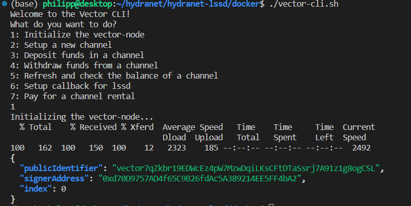

# Lightwallet Simple Swap Daemon (LSSD)

## Table of Contents
1. [Introduction](#introduction)
2. [Prerequisites](#prerequisites)
3. [Installation](#installation)
4. [Initialization](#initialization)
5. [Usage](#usage)
6. [Additional Resources](#additional-resources)
7. [Contributing](#contributing)
8. [License](#license)

## Introduction
LSSD (Lightwallet Simple Swap Daemon) is a tool designed to interact with the Hydranet DEX API, providing a layer 2 swap solution for seamless trading.
It utilizes a gRPC interface for placing orders, subscribing to the orderbook, and developing various trading strategies. To facilitate swaps between Lightning and EVM networks, LSSD requires access to a Lightning LND node and a Vector Node. This document outlines the steps necessary to set up and use LSSD via Docker.


The LSSD does not contain any wallet functionalities and relies on the LND and Vector Node which act as the wallets.
The main tasks that the LSSD fullfils are:

- Channel Rentals
- Interacting with the orderbook
- Paying fees and maker payments
- Executing atomic cross chain swaps using LND and Vector


## Prerequisites
- This guide was tested on Ubuntu 20 and the prepare.sh script will only work for Ubuntu.
- Any linux distribution that can run docker will work. 
- At least 8GB of memory
- Internet access
- Git to clone this repository
- Basic knowledge of the Linux CLI
- Know how on how to interact with a Protobuf GRPC interface programatically

## Installation
### Step 1: Clone the Repository
```git clone https://github.com/hydra-net/hydranet-lssd.git && cd hydranet-lssd```
### Step 2: Run the prepare script to install docker and other requirements
```sudo ./prepare.sh```

If you see this output, the installation was successful:

```Unable to find image 'hello-world:latest' locally
latest: Pulling from library/hello-world
c1ec31eb5944: Pull complete 
Digest: sha256:ac69084025c660510933cca701f615283cdbb3aa0963188770b54c31c8962493
Status: Downloaded newer image for hello-world:latest

Hello from Docker!
```

### Step 3: Prepare Vector

#### Prepare a wallet for Ethereum and Arbitrum and export the seedphrase. You can use Metamask for this.
Fund the wallet with enough Ethereum for the onchain transactions (channel setup, deposits) and with the ERC20 tokens you want to trade with offchain.

The seedphrase will be used by the Vector-Node to access the wallet.

Open "bot-0-vector-config.json" and paste the seedphrase under "mnemonic". Make sure that no one can access this file, as the seedphrase is stored in clear-text.


### Step 4: Prepare LSSD with the API Key
#### To use the LSSD, you need to obtain a secret API key from the hub providers. You can get that in the Hydranet Discord. API keys determine wether the bot has to pay a fee or not. 

Open "docker-compose.yaml" and find the bot-0-lssd section.
Paste your API key.


### Step 5: Prepare Lightning LND

#### LND contains its own bitcoin wallet which we can utilize.
#### https://www.ridethelightning.info/ provides a browser based GUI for LND, which will be setup during this tutorial.

LND and RTL will automatically be launched by docker-compose. After they have been started, you need to execute some scripts to initiliaze them.
```
    - ./lnd-create-wallet.sh -> required for the setup of the LND wallet
    - ./unlock-lnd.sh -> unlock the wallet within LND, required after a restart
    - ./get-new-lnd-address.sh -> generates a new P2WKH address for the LND wallet
    - ./get-lnd-info.sh -> prints status information about the lnd
```
All of those things except creating the wallet can also be done using the RTL browser GUI, which is explained in the next step. Do not execute any of those scripts yet.

### Step 6: Launch everything using docker-compose
#### Before executing the next command, make sure that you have configured your vector mnemonic and lssd api key.

```
cd docker 
docker-compose up -d
```

This will start the LSSD, Vector-Node, LND and RTL containers in the background.


### Step 7: Create LND wallet

Run this script and follow its instructions to either create a new BTC wallet or import an existing wallet via its seedphrase.

```./lnd-create-wallet.sh```


#### After this step, you should see a message "lnd successfully initialized"
You can now access the RTL GUI by opening your browser and entering "localhost:3006" as the URL. Use "test" as the password.


To fund your Bitcoin Lightning Node, you can generate a new address and send the funds to that address


#### Connect your LND to the Hub
To connect your Lightning Node to the Hub go to "Lightning" -> "Peers" -> "Add Peer" in the RTL UI.

Use "03c23b7f5b9fa984705678b96821f4d15133ced6ef58c0521e4dcca434e0d5a50a@lnd-mainnet.hydranet.to:30980"

This needs to be done only once.


After the peer is added, you must open a channel to be able to trade Bitcoin offchain.
Go to "Channels", select the peer and enter an amount. Do not use the "Private Channel" option.


Now you are able to send Bitcoin via Lightning. If you do not want to sell Bitcoin but only receive them, you dont have to open a channel, but rent one, which can be done in a later step using the LSSD API.

You can come back to this step any time later, if you want to send additional funds to the Lightning network.

### Step 8: Initialize Vector Node

#### The Vector Node as not grahpical UI, but can be accessed through the interactive "vector-cli.sh".


```
./vector-cli.sh
```

Initialize the vector-node by chosing option 1. This is a one time task.



Setup callbacks from the Vector Node to the LSSD. This is a one time task.


Now you need to setup channels on either Ethereum Mainnet and Arbitrum Mainnet, or both if you want. This is a one time task per chain and you dont have to setup a channel on Mainnet, if you only want to trade on Arbitrum.

```./vector-cli.sh```


Use the vector-cli option 5 to check your channels and balances.


### Depositing funds in a Vector Channel

To deposit funds, you can use option 3 from the vector-cli.


# LSSD
#### LSSD is the central piece of software in this setup, that execute the lightning swaps and offers an API to interact with the Orderbook and Hub.
To connect to the lssd, you need to use its GRPC interface.
In the file "lssdprc.proto" you can find the Protobuf definitions. You can generate bindings for almost any programming language you like to use to write your trading bot. https://protobuf.dev/getting-started/

For the sake of this guide, we will use Postman to demonstrate the interface.

Please see this documentation on how to import protobuf definitions in Postman. https://learning.postman.com/docs/sending-requests/grpc/using-service-definition/


## Registering Currencies in the LSSD
#### LSSD connects to the Vector and Lightning Node and receives callbacks from them. LSSD is agnostic of which Token you can trade.
To establish this connection a command for each currency must be executed to enable it. This must be done every time after restarting the LSSD and its best to automate it in your bot.


### Adding Connext Vector currencies 
"connextChannel" is the URL of your vector-node as it can be found in the docker-compose.yaml
"eventResolver" always add "0.0.0.0:9012"
"tokenAddress" add the token erc20 contract address.


#### tokenAddresses: 
```
HDN "0x3404149e9EE6f17Fb41DB1Ce593ee48FBDcD9506"
USDC "0xA0b86991c6218b36c1d19D4a2e9Eb0cE3606eB48"
USDT "0xdAC17F958D2ee523a2206206994597C13D831ec7"
AUSDC "0xaf88d065e77c8cC2239327C5EDb3A432268e5831"
AUSDT "0xFd086bC7CD5C481DCC9C85ebE478A1C0b69FCbb9"
ETH "0x0000000000000000000000000000000000000000"
AETH "0x0000000000000000000000000000000000000000"
```

### Adding BTC Lightning


## Rent inbound liquidity.
#### Now that we have set up channels and deposited funds in the local side of the channel using LND and Vector, we need to rent inbound liquidity from the hub to be able to receive funds.
Inbound liquidity via rentals requires renting fee payments.
To execute the rentals, you need to use the lssd grpc interface explained above.

#### Connext Channel Contract Deployment Fee

For Vector it also requires paying and registering a one time contract deployment fee, without paying you cant rent channels. This is a one time fee and is different from channel rental fees. For Bitcoin / Lightning no such one time fee exists.

The fee needs to be paid before doing anything else with Vector channels and is paid via an on-chain native Eth transaction. After that transaction is made, it needs to be registered via the LSSD API.
It needs to be paid for each chain you want to trade on (currently Ethereum Mainnet and Arbitrum).

To obtain the fee, use the "GetConnextChannelContractDeploymentFee" RPC method and pass the chainId.


The response contains the address to which you need to send the fee and the amount in ETH.

After sending the ETH to the address, save the transaction-hash, it will be needed to register the fee payment for this bot.

Now use the "RegisterConnextChannelContractDeploymentFee" method and pass the transaction hash and chain id.


If you run "GetConnextChannelContractDeploymentFee" agian, it should show a value of 0 for the fee now.

```
{
    "hubAddress": "0xAD24aB5F45E8f52dc867D3A4932eAF4CC9D0af6A",
    "amount": {
        "value": "0.000000"
    }
}
```

#### Get fee to rent channel
Before you can rent a channel, you need to obtain the fees that need to be paid to the hub for providing temporary liquidity to receive funds. 

This can be done by "GetFeeToRentChannel", which takes a capacity and currency you want to rent and returns the amount of fees that need to be paid in the "payingCurrency"


Note down the "fee" value, you will need it later.


The next command you need to obtain the invoice to pay the fee to depends on your payingCurrency.

- BTC / LTC -> GenerateRentChannelInvoice
- ETH / ERC20 -> GenerateRentChannelPaymentHash

Use the exact same parameters as in the "GetFeeToRentChannel" command and the response will be a lightning invoice or a Vector paymenthash, that needs to be paid for the rental to succeed.


Now you have the paymenthash and the fee amount. To pay this use either RTL for Bitcoin or vector-cli.sh


After the payment has been made, note down the "nodePublicKey" that has been outputted.

#### Execute the rental
To execute the rental, you first need to activate the currencies in the LSSD.
This is done by the "AddCurrency" command. See the section above on how to do that. 

In this example we are renting AUSDT paid with HDN, so we need to make sure that we have HDN and AUSDT added via "AddCurrency".


## Interacting with the orderbook
#### To interact with the orderbook, you need to enable trading pairs to subscribe to orderbook updates or place orders.

## Enabling a trading pair
Use the "EnableTradingPair" command and pass the pairId to activate a trading 
pair.

The following pair IDs are currently available:

```
ETH_BTC
BTC_USDT
BTC_USDC
BTC_AUSDT
BTC_AUSDC
HDN_AUSDT
AETH_HDN
AETH_BTC
```


Multiple pairs can be activated at the same time.


## Listing Orders
After enabling a pair, you can ListOrders, ListOwnOrders, SubscribeOrders to get a stream of new orders and PlaceOrders to trade on the orderbook.


## Placing Orders
#### When placing an order, the order can either be immidiately matched or it can be placed in the orderbook to wait for someone else to match it. This will be automatically handeled by the LSSD and the swap will be executed in the background.

To place a market order, simply set the price value to 0.

To place a limit order, set the price value to your desired price.

Setting side to 0 is a Buy order while setting side to 1 is a sell order.

```
message PlaceOrderRequest
{
    string pairId = 1;
    OrderSide side = 2; // whether you are buying or selling
    BigInteger funds = 3; // the funds you want to exchange, for buy in quote currency, for sell in
                          // base currency. Basically funds that you own.
    BigInteger price = 4; // missing on market orders
}
```

Base currency is the first element of the pair while quote currency is the second.

E.g. HDN(base)_AUSDT(quote).


If your LSSD API key has fees enabled, the fee payment will be handled automatically by the LSSD when placing the order.


# Vortex Bot (reference implementation)
You can find a working example for a bot implementation using Rust in this public repository:

https://github.com/hydra-net/vortex-

Before using this bot, please make sure that the manual test trade using postman from above is working.


## Logs
To access the individual components logs, use the following commands:

Vector
```
docker-compose logs -f bot-0-vector-node
```
LND
```
docker-compose logs -f bot-0-lnd-btc
```
LSSD
```
docker-compose logs -f bot-0-lssd
```


